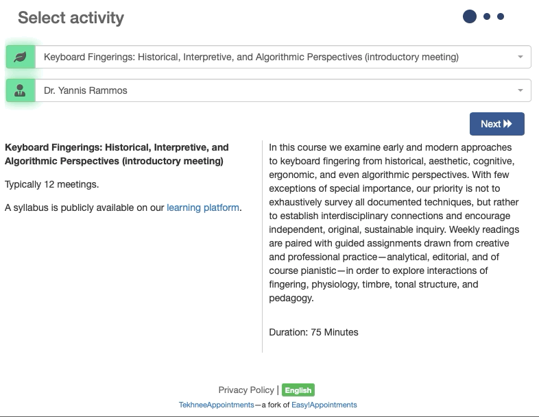
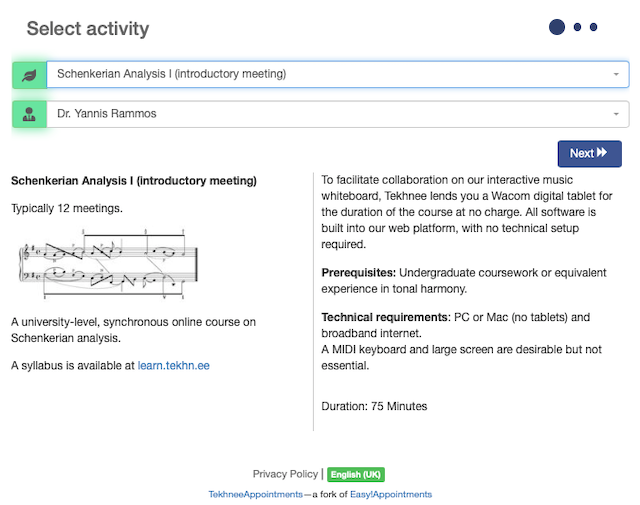
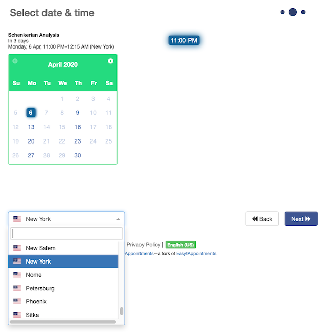
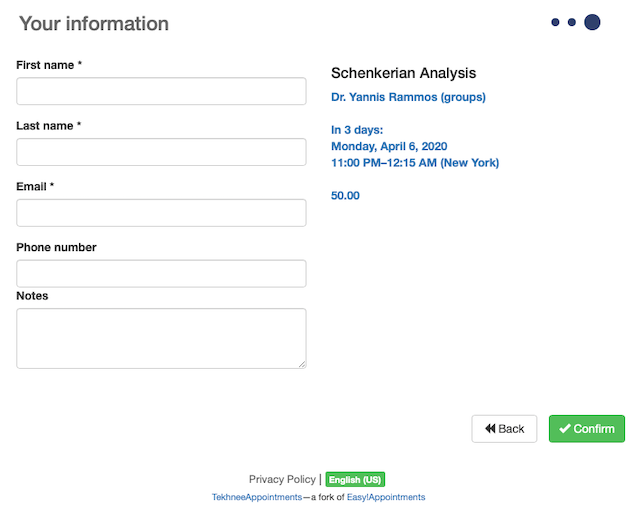
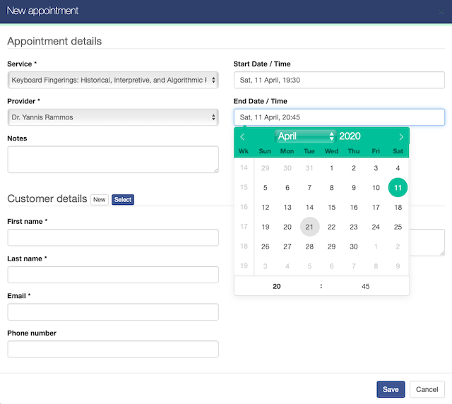
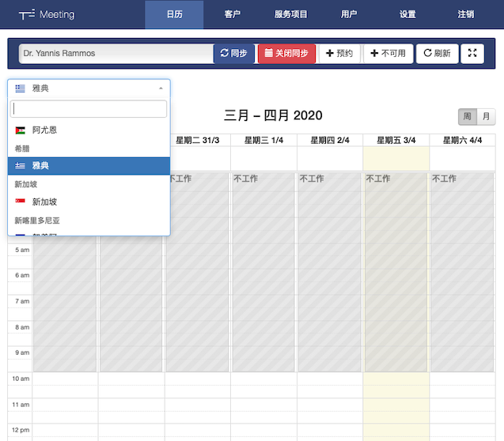

# TekhneeAppointments

TekhneeAppointments is an extensive fork of [EasyAppointments](https://github.com/alextselegidis/easyappointments/) for round-the-clock, timezone-aware, multilingual, locale-sensitive operations.

## Fork features

- **Locale-specific services.** Services may now be targeted to specific locales ([watch video](#internationalizing-service-names-and-descriptions)).
- **Seamless 24hr schedule**, allowing appointments to cross over, past midnight, into the following date (see [screenshots](#screenshots)).
- **Time-zone** support on frontend (booking), backend (admin), and in notification emails (see [screenshots](#step-2)).
- **Official time-zone designations** from the Unicode [CLDR-data](https://github.com/unicode-org/cldr) repository.
- **Multilingual time-zone selector**, searchable by city and country, in both English and the user's language.
- Support for events longer than 24 hours.
- Infrastructure and support for **dialects** (e.g. 'en-GB').
- **Rich-text service descriptions in HTML** (see [screenshot](#screenshots)).
- Multilingual language selector ([watch video](#internationalizing-service-names-and-descriptions)).
- Automatic locale detection based on browser settings.
- Dates, times, and time-zones in the language and format of the locale (see [screenshots](#step-2)).
- Workflow optimizations for speedy appointment creation on the backend (see [screenshots](#backend)).
- Streamlined booking process (one step less).
- Abbreviated booking form, sacrificing the address, city, and ZIP code fields for real-estate savings and smaller privacy footprint.

## Additional tweaks

- Optionally hide service descriptions from the front page (`&mini=true` URL parameter).
- Optionally skip over the service selection step, landing straight in the date-time selection step (`&proceed=true` URL parameter). (Serving suggestion: `&proceed=true&service=N` to direct clients directly to the calendar for service _N_).
- Booking view embeddable as `<iframe />`.
- Service descriptions of arbitrary length, suitable for academic and other complex services.
- HTML sanitization via [HTML Purifier](http://htmlpurifier.org/).
- [Select2](https://select2.org/)-based controls.
- [Flatpickr2](https://flatpickr.js.org)-based date-time picker on the backend, with defaults for speedy appointment entry.
- Booking form automatically populated with session-stored client data for speedy multiple bookings.
- Other opinionated design changes and cosmetic tweaks (including a two-column layout for service descriptions on large screens).

## Development workflow

- Dependencies are entirely managed via `npm` and `gulp`.
- Docker support is not available; relevant pull requests warmly welcome.

The fork represents the specific use-case of [the workshop](https://tekhnee.org) and is opinionated on occasion, introducing a small number of [breaking changes](#breaking-changes).

## Internationalizing service names and descriptions

[↑](#main-features)

TekhneeAppointments applies a simple tagging convention for assigning locales to sevice categories:

- Service categories carrying one (or more) tags are visible in the respective locale(s) only.
- Valid tags consist of a locale code wrapped in square brackets (e.g. `[pt-BR]`.)
- Untagged service categories are visible in all locales.
- Invalid locale codes are interpreted as literal elements of the category name and rendered in the booking form alongside the flanking square brackets.

### Examples

|          Category name           |                                                 Visibility                                                 |
| -------------------------------- | ---------------------------------------------------------------------------------------------------------- |
| `[el] Σεμινάρια`                  | Displayed as `Σεμινάρια` in Greek; hidden otherwise.                                                        |
| `[en-US-POSIX] [en-GB] Seminars` | Displayed as `Seminars` in US Engish and British English; hidden otherwise.                                |
| `Семинары`                       | Displayed as such in all locales.                                                                          |
| `[en] Seminars`                  | Invalid tag; category displayed in full, including the square brackets and their contents, in all locales. |

### Locale codes

The following list of codes is comprehensive, culled directly from the `$config['available_languages']` array in `./src/application/config/config.php`:

|    Code     |       Language       |
| ----------- | -------------------- |
| ar          | Arabic               |
| bg          | Bulgarian            |
| da          | Danish               |
| de          | German               |
| el          | Greek                |
| en-GB       | British English      |
| en-US-POSIX | US English           |
| es          | Spanish              |
| fi          | Finnish              |
| fr          | French               |
| hi          | Hindi                |
| hu          | Hungarian            |
| it          | Italian              |
| ja          | Japanese             |
| lb          | Luxembourgish        |
| nl          | Dutch                |
| pl          | Polish               |
| pt          | Portuguese           |
| pt-BR       | Brazilian Portuguese |
| ro          | Romanian             |
| ru          | Russian              |
| sk          | Slovak               |
| tr          | Turkish              |
| zh          | Chinese              |

## Installation

1. Clone this repo—or better still fork it, in the likely event that you'd rather add your own logo and particulars. (Kindly note that the GPLv3 license prohibits removal of copyright notices.)
2. `$ npm install`
3. `$ cp config-sample.php config.php`
4. `$ vi config.php` to add your own
5. `$ gulp production`
6. [Deploy](#deployment)

If in trouble, start with the [installation notes](https://github.com/alextselegidis/easyappointments#installation) of the original app, and [submit an issue](https://github.com/tekhnee/appointments/issues) in case of persistent issues.

## Building

This fork uses a modified `gulp` script for development and deployment. Please note that a Docker container is **no longer available** (pull requests to reinstate it are welcome).

Run `$ gulp --tasks` for a complete list of available build scripts.

### Development mode

`$ gulp` or `$ gulp default`.

### Updating dependencies

`$ npm update` updates JavaScript dependencies (including CLDR data).

`$ composer update` updates PHP dependencies.

`$ gulp dependencies` must be run manually after each dependency update; the script injects all relevant dependencies into the application source tree (`/src`).

### Preflight

`$ gulp version` to have the version number injected into the user interface of the app.

`$ gulp production` for code compression, version injection, and other housekeeping tasks prior to uploading to your server.

### Deployment

Replace all placeholders in `gulpfile.js` with your admin credentials.

`$ gulp deploy` to upload the build (`/dist` directory) onto your webserver.

## Migrations (database schema updates)

If you are transferring an existing EasyAppointments database to TekhneeAppointments, you'll need to follow the migration procedure described in the EasyAppointments [Update Guide](https://github.com/alextselegidis/easyappointments/blob/master/doc/update-guide.md). Please note that the process is not straightforwardly reversible. Back up your database before migrating.

## API documentation

TekhneeAppointments extends the upstream REST API but, due to lack of development resources, changes are documented only in code commentary. To prevent confusion, the documentation generator of the upstream channel has been removed from the fork. Pull requests by meticulous documentation writers are warmly welcome. Most API extensions pertain to the handling of timezones and timestamps, and are easily inferrable.

## Theming

The CSS code is self-evident. You'll probably choose to substitute your own logos and favicon for the bundled placeholder elements.

## Breaking changes

- The Day and Table calendar formats of the upstream channel have been removed.

[↑](#additional-tweaks)

## Contributing

This fork is a side-project and further development not a priority; pull requests (bug fixes, documentation, unit tests) are therefore warmly welcome.

## Screenshots

### Step #1

[↑](#main-features)

***

### Step #2

[↑](#main-features)

***

### Step #3

[↑](#main-features)

***

### Backend

[↑](#main-features)

## Acknowledgment

Thanks are due to [@alextselegidis](https://github.com/alextselegidis) for building Easy!Appointments, which served as foundation for this project.

[↑](#main-features)
